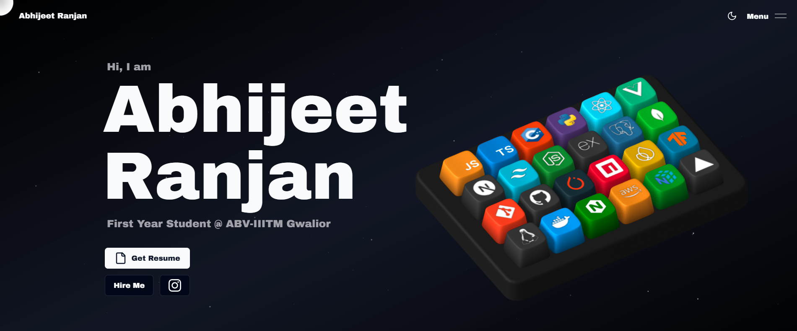

# Abhijeet Ranjan Portfolio



A polished personal portfolio for Abhijeet Ranjan with an interactive 3D room, project dashboard, skills showcase, and contact experience. The site is built to feel smooth, responsive, and ready for professional deployment.

## Features

- Interactive 3D room experience with clear controls and object interactions.
- Project dashboard with screenshots, descriptions, and repository links.
- Responsive sections for home, about, projects, skills, and contact.
- Smooth motion using GSAP and Framer Motion.
- Optimized media loading for faster first paint and smoother browsing.
- Contact form support through Resend.

## Tech Stack

- Next.js 14
- React
- Tailwind CSS
- Three.js
- GSAP
- Framer Motion
- Spline
- Resend

## Project Structure

```text
src/                 Application source code
public/assets/       Images, 3D assets, project media, and SEO previews
netlify.toml         Netlify build configuration
.netlifyignore       Files excluded from Netlify deployment
```

## Getting Started

```bash
git clone https://github.com/Abhi190702/Portfolio.git
cd Portfolio
npm install
npm run dev
```

Open the local site at:

```text
http://localhost:3000
```

## Environment Variables

Create a `.env.local` file in the project root when running locally:

```env
RESEND_API_KEY=your_resend_api_key_here
```

Keep this key private and add it directly in the deployment platform settings for production.

## Netlify Deployment

Use these settings in Netlify:

- Build command: `npm run build`
- Publish directory: `.next`
- Node version: `20`
- Environment variable: `RESEND_API_KEY`

The repository includes `netlify.toml`, so Netlify can detect the Next.js build configuration automatically.
